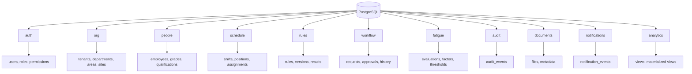
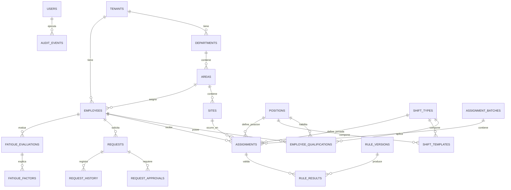

# Estructuración y Modelado General de Base de Datos

## Sistema de Gestión de Asignaciones Operativas, Turnos, Reglas y Fatiga

---

## 1. Objetivo del documento

Este documento define una propuesta general de estructuración y modelado de base de datos para un sistema web encargado de gestionar asignaciones semanales de personal operativo por jornada, posición, sitio y departamento.

El sistema debe soportar:

- Múltiples empresas en el futuro.
- Departamentos, áreas y sitios operativos.
- Empleados con capacidades específicas por posición y jornada.
- Programación semanal de turnos.
- Reglas operativas complejas.
- Descansos, vacaciones, permisos, calamidades e incapacidades.
- Intercambios de turno con aprobación.
- Evaluación de fatiga y sobrecarga.
- Auditoría, trazabilidad y métricas.
- Documentos, notificaciones y reportes.

La base de datos principal propuesta es **PostgreSQL**, organizada mediante **esquemas por dominio funcional**.

---

## 2. Principios generales de diseño

La base de datos debe diseñarse como el núcleo confiable del sistema, no como un simple almacenamiento de formularios.

Principios recomendados:

1. **PostgreSQL como fuente oficial de datos.**
2. **Esquemas por dominio**, no por entidad ni por ambiente.
3. **Multiempresa desde el inicio** usando `tenant_id`.
4. **Llaves primarias técnicas con UUID**.
5. **Llaves alternativas únicas para códigos de negocio**.
6. **Llaves foráneas solo para relaciones fuertes y críticas**.
7. **Estados simples mediante `CHECK` o enums controlados**, no siempre con tablas catálogo.
8. **Tablas hijas para procesos repetibles**, como aprobaciones, factores de fatiga, documentos e historial.
9. **JSONB solo para configuraciones flexibles**, no para reemplazar entidades relacionales.
10. **Vistas para facilitar consultas operativas**.
11. **Vistas materializadas para dashboards pesados**.
12. **Auditoría obligatoria para acciones críticas**.
13. **Versionamiento de reglas desde el inicio**.
14. **Particionamiento futuro para tablas de alto crecimiento**.
15. **Migraciones controladas con Alembic**.

---

## 3. Diferencia entre ambiente, base de datos y esquema

Los ambientes no deben modelarse como esquemas dentro de una misma base productiva.

### Ambientes recomendados

Cada ambiente debe tener su propia base de datos:

```text
control_turnos_dev
control_turnos_qa
control_turnos_staging
control_turnos_prod
```

Cada base debe tener la misma estructura de esquemas:

```text
auth
org
people
schedule
rules
workflow
fatigue
audit
documents
notifications
analytics
```

### Ejemplo correcto

```text
BD: control_turnos_prod
Schema: schedule
Tabla: assignments
```

### Ejemplo no recomendado

```text
BD: control_turnos
Schema: dev
Schema: qa
Schema: prod
```

---

## 4. Esquemas propuestos por dominio

```text
PostgreSQL
├── auth
├── org
├── people
├── schedule
├── rules
├── workflow
├── fatigue
├── audit
├── documents
├── notifications
└── analytics
```

---

## 5. Esquema `auth`

Dominio encargado de usuarios, roles, permisos y control de acceso.

### Tablas principales

```text
auth.users
auth.roles
auth.permissions
auth.user_roles
auth.role_permissions
auth.sessions
auth.refresh_tokens
```

### Tabla: `auth.users`

Representa usuarios de la plataforma.

```text
id uuid PK
tenant_id uuid FK
employee_id uuid nullable FK
username
email
password_hash
is_active
is_superuser
last_login_at
created_at
updated_at
```

Restricciones recomendadas:

```text
UNIQUE (tenant_id, username)
UNIQUE (tenant_id, email)
```

### Tabla: `auth.roles`

```text
id uuid PK
tenant_id uuid FK nullable
code
name
description
level
is_system_role
created_at
```

Ejemplos de roles:

```text
ADMIN_NIVEL_4
SUPERVISOR_NIVEL_1
CONTROLADOR
AUDITOR
GESTOR_DOCUMENTAL
```

### Tabla: `auth.permissions`

```text
id uuid PK
code
name
description
module
```

Ejemplos:

```text
schedule.create
schedule.approve
schedule.publish
workflow.approve
fatigue.review
rules.configure
audit.view
```

---

## 6. Esquema `org`

Dominio encargado de la estructura organizacional y multiempresa.

### Tablas principales

```text
org.tenants
org.departments
org.areas
org.sites
org.holidays
```

### Tabla: `org.tenants`

Representa cada empresa cliente.

```text
id uuid PK
name
tax_id
status
created_at
updated_at
```

### Tabla: `org.departments`

```text
id uuid PK
tenant_id uuid FK → org.tenants.id
code
name
status
created_at
```

Restricción:

```text
UNIQUE (tenant_id, code)
```

### Tabla: `org.areas`

```text
id uuid PK
tenant_id uuid FK
department_id uuid FK → org.departments.id
code
name
status
```

Restricción:

```text
UNIQUE (tenant_id, department_id, code)
```

### Tabla: `org.sites`

Representa sitios físicos u operativos.

```text
id uuid PK
tenant_id uuid FK
area_id uuid FK → org.areas.id
code
name
location
status
```

Restricción:

```text
UNIQUE (tenant_id, area_id, code)
```

### Tabla: `org.holidays`

Maneja festivos, domingos especiales y fechas no ordinarias.

```text
id uuid PK
tenant_id uuid nullable FK
country_code
holiday_date date
name
holiday_type
created_at
```

---

## 7. Esquema `people`

Dominio encargado del personal, sus grados, disponibilidad y capacidades.

### Tablas principales

```text
people.employees
people.employee_grades
people.employee_statuses
people.employee_qualifications
people.employee_availability
people.employee_contracts
people.employee_documents
```

### Tabla: `people.employees`

```text
id uuid PK
tenant_id uuid FK
employee_code
document_number
full_name
email
phone
department_id uuid FK
area_id uuid FK
grade_id uuid FK
status
created_at
updated_at
```

Restricciones:

```text
UNIQUE (tenant_id, employee_code)
UNIQUE (tenant_id, document_number)
```

### Tabla: `people.employee_grades`

Permite definir reglas por grado, por ejemplo horas extra máximas.

```text
id uuid PK
tenant_id uuid FK
code
name
grade_number
max_monthly_overtime_hours
max_weekly_12h_shifts
created_at
```

Ejemplo:

```text
Grado 16 o menor: máximo 50 horas mensuales
Grado mayor a 16: máximo 25 horas mensuales
```

### Tabla: `people.employee_qualifications`

Define qué posiciones puede hacer cada empleado.

```text
employee_id uuid FK → people.employees.id
position_id uuid FK → schedule.positions.id
shift_type_id uuid nullable FK → schedule.shift_types.id
can_work boolean
valid_from date
valid_to date nullable
restriction_reason text nullable
created_at
```

Llave primaria compuesta sugerida:

```text
PRIMARY KEY (employee_id, position_id, shift_type_id, valid_from)
```

Ejemplos:

```text
CAW puede hacer APT, APA, APR, TOT, TOA, COT, SPT.
JAE puede hacer todas las posiciones.
NBG puede hacer todas menos MSPT, TSPT, NSPT, ASPT.
NRG puede hacer todas.
```

---

## 8. Esquema `schedule`

Dominio principal para jornadas, posiciones, plantillas y asignaciones.

### Tablas principales

```text
schedule.shift_types
schedule.positions
schedule.shift_templates
schedule.assignment_batches
schedule.assignments
schedule.assignment_versions
schedule.assignment_acknowledgements
schedule.operational_breaks
```

### Tabla: `schedule.shift_types`

Representa jornadas: mañana, tarde, noche, H24.

```text
id uuid PK
tenant_id uuid FK
code
name
start_time
end_time
duration_hours
is_night boolean
is_h24 boolean
status
```

Ejemplos:

```text
M = Mañana
T = Tarde
N = Noche
H24 = Jornada 24 horas
```

Restricción:

```text
UNIQUE (tenant_id, code)
```

### Tabla: `schedule.positions`

Representa posiciones operativas.

```text
id uuid PK
tenant_id uuid FK
code
name
description
is_high_demand boolean
status
```

Ejemplos:

```text
SPT
APT
APA
APR
TOT
TOA
COT
```

Restricción:

```text
UNIQUE (tenant_id, code)
```

### Tabla: `schedule.shift_templates`

Une jornada + posición para generar códigos como MSPT, TSPT o NSPT.

```text
id uuid PK
tenant_id uuid FK
shift_type_id uuid FK → schedule.shift_types.id
position_id uuid FK → schedule.positions.id
generated_code
status
```

Restricciones:

```text
UNIQUE (tenant_id, shift_type_id, position_id)
UNIQUE (tenant_id, generated_code)
```

Ejemplo:

```text
M + SPT = MSPT
T + SPT = TSPT
N + SPT = NSPT
```

### Tabla: `schedule.assignment_batches`

Representa una programación semanal.

```text
id uuid PK
tenant_id uuid FK
area_id uuid FK
site_id uuid nullable FK
week_start_date date
week_end_date date
status
created_by uuid FK
approved_by uuid nullable FK
published_at timestamp nullable
created_at timestamp
updated_at timestamp
```

Estados sugeridos:

```text
BORRADOR
PROCESANDO
PENDIENTE_REVISION
APROBADA
PUBLICADA
CANCELADA
ERROR
```

### Tabla: `schedule.assignments`

Tabla principal de asignaciones.

```text
id uuid PK
tenant_id uuid FK
batch_id uuid FK → schedule.assignment_batches.id
employee_id uuid FK → people.employees.id
site_id uuid FK → org.sites.id
shift_type_id uuid FK → schedule.shift_types.id
position_id uuid FK → schedule.positions.id
start_datetime timestamp
end_datetime timestamp
status
source
created_by uuid FK
approved_by uuid nullable FK
created_at timestamp
updated_at timestamp
```

Estados sugeridos:

```text
BORRADOR
VALIDADA
APROBADA
PUBLICADA
MODIFICADA
CANCELADA
```

Origen sugerido:

```text
MANUAL
AUTOMATICO
INTERCAMBIO
CORRECCION
IMPORTADO
```

Campos de snapshot recomendados:

```text
employee_code_snapshot
employee_name_snapshot
shift_code_snapshot
position_code_snapshot
site_code_snapshot
```

Estos campos permiten conservar la fotografía histórica, aunque luego cambie el nombre o código de una entidad.

### Tabla: `schedule.assignment_versions`

Guarda versiones anteriores de una asignación.

```text
id uuid PK
assignment_id uuid FK
version_number
old_value_json jsonb
new_value_json jsonb
changed_by uuid FK
change_reason
created_at
```

### Tabla: `schedule.assignment_acknowledgements`

Permite que empleados confirmen que revisaron su programación.

```text
id uuid PK
tenant_id uuid FK
assignment_id uuid FK
employee_id uuid FK
acknowledged_at timestamp
comment text nullable
```

### Tabla: `schedule.operational_breaks`

Maneja pausas TROP o recesos operativos.

```text
id uuid PK
tenant_id uuid FK
assignment_id uuid FK
break_start timestamp
break_end timestamp
break_type
status
created_at
```

---

## 9. Esquema `rules`

Dominio encargado de reglas, versiones, resultados y excepciones.

### Tablas principales

```text
rules.rule_definitions
rules.rule_versions
rules.rule_results
rules.rule_exceptions
```

### Tabla: `rules.rule_definitions`

```text
id uuid PK
tenant_id uuid FK
code
name
description
scope
severity
is_active
created_at
```

Ejemplos de reglas:

```text
REST_MIN_DAILY
NO_NIGHT_AFTER_M_T
NO_H24_CONSECUTIVE
MAX_OVERTIME_BY_GRADE
POSITION_QUALIFICATION_REQUIRED
HOLIDAY_SPECIAL_RULE
```

### Tabla: `rules.rule_versions`

Versiona la configuración de una regla.

```text
id uuid PK
rule_id uuid FK → rules.rule_definitions.id
version_number
valid_from date
valid_to date nullable
config_json jsonb
created_by uuid FK
created_at timestamp
```

Ejemplo de `config_json`:

```json
{
  "min_rest_hours": 12,
  "after_h24_rest_hours": 54,
  "block_consecutive_night": true
}
```

### Tabla: `rules.rule_results`

Guarda el resultado de evaluación de reglas.

```text
id uuid PK
tenant_id uuid FK
batch_id uuid nullable FK
assignment_id uuid nullable FK
request_id uuid nullable FK
rule_version_id uuid FK
result
message
evaluated_at timestamp
```

Resultados sugeridos:

```text
PASSED
WARNING
BLOCKED
EXCEPTION_REQUIRED
```

### Tabla: `rules.rule_exceptions`

Permite manejar excepciones aprobadas.

```text
id uuid PK
tenant_id uuid FK
rule_result_id uuid FK
approved_by uuid FK
reason
valid_until timestamp nullable
created_at
```

---

## 10. Esquema `workflow`

Dominio encargado de solicitudes, aprobaciones e historial.

### Tablas principales

```text
workflow.requests
workflow.request_approvals
workflow.request_history
workflow.request_documents
```

### Tabla: `workflow.requests`

```text
id uuid PK
tenant_id uuid FK
request_type
requested_by_employee_id uuid FK
target_employee_id uuid nullable FK
assignment_id uuid nullable FK
status
reason
created_at timestamp
resolved_at timestamp nullable
```

Tipos de solicitud sugeridos:

```text
CAMBIO_TURNO
PERMISO_MEDICO
PERMISO_PERSONAL
VACACIONES
CALAMIDAD
INCAPACIDAD
```

Estados sugeridos:

```text
CREADA
PENDIENTE_COMPAÑERO
PENDIENTE_SUPERVISOR
APROBADA
RECHAZADA
APLICADA
CANCELADA
```

### Tabla: `workflow.request_approvals`

No se recomienda meter las aprobaciones como columnas dentro de `requests`.

Mejor manejar pasos de aprobación:

```text
id uuid PK
request_id uuid FK → workflow.requests.id
approval_step
approver_user_id uuid FK
status
comment
approved_at timestamp nullable
created_at timestamp
```

Ejemplo:

```text
Paso 1: compañero acepta.
Paso 2: supervisor aprueba.
Paso 3: administrador valida si aplica.
```

### Tabla: `workflow.request_history`

```text
id uuid PK
request_id uuid FK
previous_status
new_status
changed_by uuid FK
comment
created_at timestamp
```

### Tabla: `workflow.request_documents`

```text
id uuid PK
request_id uuid FK
file_id uuid FK → documents.files.id
document_type
created_at
```

---

## 11. Esquema `fatigue`

Dominio encargado de evaluar fatiga, sobrecarga y factores de riesgo.

### Tablas principales

```text
fatigue.fatigue_evaluations
fatigue.fatigue_factors
fatigue.fatigue_thresholds
```

### Tabla: `fatigue.fatigue_evaluations`

```text
id uuid PK
tenant_id uuid FK
employee_id uuid FK
batch_id uuid nullable FK
assignment_id uuid nullable FK
evaluation_date date
score numeric
risk_level
status
created_at
```

Niveles de riesgo sugeridos:

```text
BAJO
MODERADO
ALTO
CRITICO
```

Estados sugeridos:

```text
PENDIENTE_REVISION
EN_SEGUIMIENTO
RESUELTO
```

### Tabla: `fatigue.fatigue_factors`

Tabla hija que explica por qué un empleado tiene determinado riesgo.

```text
id uuid PK
fatigue_evaluation_id uuid FK
factor_code
factor_value
weight
message
created_at
```

Ejemplos de factores:

```text
DESCANSO_INSUFICIENTE
TURNOS_NOCTURNOS_CONSECUTIVOS
HORAS_EXTRA_ALTAS
H24_RECIENTE
POSICION_ALTA_DEMANDA
```

### Tabla: `fatigue.fatigue_thresholds`

```text
id uuid PK
tenant_id uuid FK
risk_level
min_score
max_score
description
created_at
```

---

## 12. Esquema `documents`

Dominio encargado de archivos y soportes.

### Tablas principales

```text
documents.files
documents.file_metadata
```

### Tabla: `documents.files`

```text
id uuid PK
tenant_id uuid FK
uploaded_by uuid FK
storage_provider
bucket
object_key
original_filename
mime_type
size_bytes
checksum
status
created_at
```

Los archivos físicos no deberían guardarse en PostgreSQL. Se recomienda guardarlos en MinIO/S3 y almacenar en PostgreSQL solo los metadatos.

### Tabla: `documents.file_metadata`

```text
id uuid PK
file_id uuid FK
metadata_key
metadata_value
created_at
```

---

## 13. Esquema `notifications`

Dominio encargado de alertas y mensajes.

### Tablas principales

```text
notifications.notification_events
notifications.notification_templates
```

### Tabla: `notifications.notification_events`

```text
id uuid PK
tenant_id uuid FK
recipient_user_id uuid FK
channel
subject
message
status
sent_at timestamp nullable
error_message nullable
created_at timestamp
```

Canales sugeridos:

```text
EMAIL
IN_APP
SMS
TEAMS
WHATSAPP
```

### Tabla: `notifications.notification_templates`

```text
id uuid PK
tenant_id uuid nullable FK
code
channel
subject_template
body_template
is_active
created_at
```

---

## 14. Esquema `audit`

Dominio encargado de auditoría y trazabilidad.

### Tabla principal

```text
audit.audit_events
```

### Tabla: `audit.audit_events`

```text
id uuid PK
tenant_id uuid FK
actor_user_id uuid nullable FK
entity_schema
entity_table
entity_id uuid
action
old_value_json jsonb nullable
new_value_json jsonb nullable
reason text nullable
ip_address
user_agent
created_at timestamp
```

Acciones sugeridas:

```text
CREATE_ASSIGNMENT
UPDATE_ASSIGNMENT
DELETE_ASSIGNMENT
BLOCK_ASSIGNMENT
APPROVE_REQUEST
REJECT_REQUEST
PUBLISH_SCHEDULE
CHANGE_RULE_VERSION
LOGIN_FAILED
```

Esta tabla puede crecer mucho, por lo que es candidata a particionamiento futuro por fecha.

---

## 15. Esquema `analytics`

Dominio encargado de vistas, vistas materializadas y consultas optimizadas para reportes.

### Vistas sugeridas

```text
analytics.vw_weekly_schedule
analytics.vw_fatigue_summary
analytics.vw_pending_requests
analytics.vw_employee_workload
analytics.vw_rule_violations
```

### Vista: `analytics.vw_weekly_schedule`

Uso: mostrar programación semanal consolidada.

Campos sugeridos:

```text
tenant_id
week_start_date
employee_code
employee_name
area_name
site_name
shift_code
position_code
start_datetime
end_datetime
assignment_status
fatigue_risk
```

### Vista: `analytics.vw_fatigue_summary`

Uso: tablero de fatiga.

Campos sugeridos:

```text
tenant_id
area_id
week_start_date
risk_level
total_employees
total_cases
```

### Vista: `analytics.vw_pending_requests`

Uso: solicitudes pendientes para supervisores.

Campos sugeridos:

```text
request_id
request_type
requested_by
target_employee
current_status
pending_step
created_at
elapsed_time
```

### Vistas materializadas sugeridas

```text
analytics.mv_monthly_overtime_summary
analytics.mv_fatigue_dashboard
analytics.mv_request_kpi_summary
```

Estas pueden refrescarse por tarea programada con Celery, por ejemplo cada noche o después de publicar una programación.

---

## 16. Llaves primarias, foráneas y alternativas

### Llaves primarias

Se recomienda usar UUID como PK técnica:

```text
id uuid PRIMARY KEY
```

Ventajas:

- No expone secuencias internas.
- Facilita multiempresa.
- Facilita integraciones futuras.
- Facilita mover datos entre ambientes o shards.

### Llaves alternativas

Cuando exista un código de negocio, usar `UNIQUE`.

Ejemplo:

```text
UNIQUE (tenant_id, employee_code)
UNIQUE (tenant_id, position_code)
UNIQUE (tenant_id, shift_code)
```

### Llaves compuestas

Son útiles en tablas de relación.

Ejemplo:

```text
employee_qualifications:
PRIMARY KEY (employee_id, position_id, shift_type_id, valid_from)
```

### Llaves foráneas

Usar FK para relaciones fuertes:

```text
employee_id
tenant_id
position_id
shift_type_id
site_id
assignment_id
request_id
```

No abusar de FK para listas simples y estables.

---

## 17. Cuándo usar FK, CHECK, tabla catálogo o JSONB


| Caso                               | Recomendación  |
| ---------------------------------- | -------------- |
| Empleado, empresa, sitio, posición | FK             |
| Estado fijo y corto                | CHECK          |
| Tipo configurable por empresa      | Tabla catálogo |
| Configuración variable de reglas   | JSONB          |
| Historial de cambios               | Tabla hija     |
| Documentos adjuntos                | Tabla hija     |
| Factores de fatiga                 | Tabla hija     |
| Aprobaciones de solicitud          | Tabla hija     |


### Ejemplo de CHECK

```sql
status text NOT NULL CHECK (
  status IN ('BORRADOR', 'APROBADA', 'PUBLICADA', 'CANCELADA')
)
```

### Ejemplo de JSONB recomendado

```text
rules.rule_versions.config_json
```

### JSONB no recomendado para

```text
empleados
asignaciones
solicitudes
aprobaciones
fatiga
auditoría principal
```

---

## 18. Evitar tablas demasiado dinámicas

Una mala práctica sería crear una tabla donde casi todo sean FK y cada pequeña lista esté en una tabla distinta.

Ejemplo no recomendado:

```text
assignment_status_id FK
assignment_source_id FK
risk_level_id FK
request_type_id FK
approval_status_id FK
notification_status_id FK
```

Esto genera exceso de joins y hace difícil mantener el modelo.

### Regla práctica

```text
Si el valor tiene reglas, vigencia, permisos o configuración: tabla.
Si el valor es simple, estable y técnico: CHECK.
```

Ejemplos:


| Valor                          | Manejo recomendado           |
| ------------------------------ | ---------------------------- |
| Posiciones: SPT, APT, APA      | Tabla `schedule.positions`   |
| Jornadas: M, T, N, H24         | Tabla `schedule.shift_types` |
| Estado: APROBADA, RECHAZADA    | CHECK                        |
| Riesgo: BAJO, MODERADO, ALTO   | CHECK                        |
| Tipos de permiso configurables | Tabla                        |
| Reglas operativas              | Tabla versionada             |


---

## 19. Índices recomendados

### Asignaciones

```sql
CREATE INDEX idx_assignments_employee_date
ON schedule.assignments (tenant_id, employee_id, start_datetime, end_datetime);

CREATE INDEX idx_assignments_batch
ON schedule.assignments (tenant_id, batch_id);

CREATE INDEX idx_assignments_site_date
ON schedule.assignments (tenant_id, site_id, start_datetime);
```

### Solicitudes

```sql
CREATE INDEX idx_requests_status
ON workflow.requests (tenant_id, status, created_at);

CREATE INDEX idx_requests_employee
ON workflow.requests (tenant_id, requested_by_employee_id, created_at);
```

### Fatiga

```sql
CREATE INDEX idx_fatigue_employee_date
ON fatigue.fatigue_evaluations (tenant_id, employee_id, evaluation_date);

CREATE INDEX idx_fatigue_risk
ON fatigue.fatigue_evaluations (tenant_id, risk_level, evaluation_date);
```

### Auditoría

```sql
CREATE INDEX idx_audit_entity
ON audit.audit_events (tenant_id, entity_schema, entity_table, entity_id);

CREATE INDEX idx_audit_created_at
ON audit.audit_events (tenant_id, created_at);
```

### Índice parcial para solicitudes pendientes

```sql
CREATE INDEX idx_pending_requests
ON workflow.requests (tenant_id, created_at)
WHERE status IN ('PENDIENTE_COMPAÑERO', 'PENDIENTE_SUPERVISOR');
```

---

## 20. Restricción para evitar solapamiento de turnos

Además de validar en FastAPI, se puede proteger desde base de datos.

Regla:

```text
Un empleado no puede tener dos asignaciones activas que se crucen en tiempo.
```

Ejemplo conceptual en PostgreSQL:

```sql
EXCLUDE USING gist (
  employee_id WITH =,
  tstzrange(start_datetime, end_datetime) WITH &&
)
WHERE (status IN ('APROBADA', 'PUBLICADA'));
```

Esta restricción debe diseñarse con cuidado y probarse bien, pero ayuda a proteger la integridad del sistema.

---

## 21. Particionamiento futuro

No se recomienda partir todo desde el inicio. Se recomienda preparar el diseño para particionar tablas de alto crecimiento.

Tablas candidatas:

```text
audit.audit_events
notifications.notification_events
schedule.assignments
rules.rule_results
fatigue.fatigue_evaluations
workflow.request_history
```

Estrategia recomendada:

```text
Particionamiento por rango de fecha.
```

Ejemplo:

```text
audit.audit_events_2026_01
audit.audit_events_2026_02
audit.audit_events_2026_03
```

---

## 22. Flujo operativo general del sistema

```text
1. Se configura la empresa.
2. Se crean departamentos, áreas y sitios.
3. Se crean jornadas y posiciones.
4. Se crean plantillas como MSPT, TSPT, NSPT.
5. Se cargan empleados.
6. Se configuran capacidades por empleado.
7. Se configuran reglas operativas.
8. Supervisor crea programación semanal.
9. Sistema valida reglas, permisos, descansos y fatiga.
10. Se guarda la programación como borrador.
11. Supervisor revisa y aprueba.
12. Se publica la programación.
13. Empleados revisan sus turnos.
14. Si hay cambios, se crean solicitudes.
15. Se aprueban o rechazan solicitudes.
16. Se recalcula fatiga si aplica.
17. Se auditan todas las acciones.
18. Se actualizan métricas y reportes.
```

---

## 23. Ejemplo operativo 1: asignación bloqueada por regla

### Caso

El supervisor intenta asignar al empleado `NBG` en jornada noche `NSPT`, pero ese empleado ya fue asignado en la mañana `MSPT` y tarde `TSPT`.

### Tablas involucradas

```text
schedule.assignments
people.employees
schedule.shift_types
schedule.positions
rules.rule_results
audit.audit_events
```

### Flujo

```text
1. FastAPI recibe solicitud de asignación.
2. Consulta asignaciones existentes del empleado para ese día.
3. Encuentra jornadas M y T.
4. El motor de reglas evalúa NO_NIGHT_AFTER_M_T.
5. La regla devuelve BLOCKED.
6. No se inserta la asignación de noche.
7. Se registra el resultado en rules.rule_results.
8. Se registra auditoría en audit.audit_events.
9. El frontend muestra mensaje de bloqueo.
```

### Resultado esperado

```text
Asignación bloqueada:
El empleado NBG ya tiene jornadas M y T para este día.
La regla activa impide asignarlo a jornada N.
```

---

## 24. Ejemplo operativo 2: solicitud de intercambio de turno

### Caso

El controlador `CAW` solicita cambiar su turno con `JAE`.

### Tablas involucradas

```text
workflow.requests
workflow.request_approvals
workflow.request_history
schedule.assignments
rules.rule_results
fatigue.fatigue_evaluations
notifications.notification_events
audit.audit_events
```

### Flujo

```text
1. CAW crea la solicitud.
2. Se inserta workflow.requests en estado PENDIENTE_COMPAÑERO.
3. Se crea workflow.request_approvals para JAE.
4. Celery envía notificación a JAE.
5. JAE acepta.
6. Se crea aprobación pendiente para el supervisor.
7. Supervisor aprueba.
8. Sistema valida descanso, capacidades, permisos y fatiga.
9. Si cumple, se actualizan las asignaciones.
10. Se registra historial.
11. Se recalcula fatiga.
12. Se notifica a los involucrados.
13. Se guarda auditoría.
```

### Resultado esperado

```text
Cambio de turno aplicado correctamente.
Solicitud aprobada por compañero y supervisor.
Validaciones operativas superadas.
```

---

## 25. Ejemplo operativo 3: programación semanal con revisión de fatiga

### Caso

El supervisor genera la programación semanal para siete empleados.

### Tablas involucradas

```text
schedule.assignment_batches
schedule.assignments
people.employee_qualifications
rules.rule_versions
rules.rule_results
fatigue.fatigue_evaluations
fatigue.fatigue_factors
analytics.vw_weekly_schedule
analytics.vw_fatigue_summary
audit.audit_events
```

### Flujo

```text
1. Supervisor crea un batch semanal.
2. El batch queda en estado PROCESANDO.
3. Celery toma la tarea.
4. El sistema consulta empleados, capacidades, permisos y reglas activas.
5. OR-Tools CP-SAT genera una propuesta de asignaciones.
6. Se validan reglas operativas.
7. Se guardan asignaciones propuestas.
8. Se calcula fatiga por empleado.
9. Se guardan factores de fatiga.
10. El batch queda en estado PENDIENTE_REVISION.
11. Supervisor revisa vistas y advertencias.
12. Si no hay bloqueos, se aprueba y publica.
```

### Resultado esperado

```text
Programación generada:
42 asignaciones propuestas.
0 reglas bloqueantes incumplidas.
3 advertencias de fatiga moderada.
1 empleado cercano al límite de horas extra.
Estado: PENDIENTE_REVISION.
```

---

## 26. Diagrama general de esquemas




---

## 27. Diagrama ER macro




---

## 28. Recomendación final

El modelo recomendado no debe ser una tabla gigante de turnos ni un diseño excesivamente fragmentado con cientos de tablas catálogo.

La propuesta equilibrada es:

```text
Entidades fuertes normalizadas.
Estados simples con CHECK.
Configuraciones flexibles con JSONB.
Relaciones críticas con FK.
Códigos de negocio con UNIQUE.
Tablas hijas para procesos repetibles.
Vistas para consultas operativas.
Vistas materializadas para reportes pesados.
Auditoría completa.
Reglas versionadas.
Particionamiento futuro en tablas de alto crecimiento.
```

La idea clave:

> La base de datos debe proteger la integridad del negocio, conservar la trazabilidad histórica y permitir que el sistema crezca sin romper la operación.

