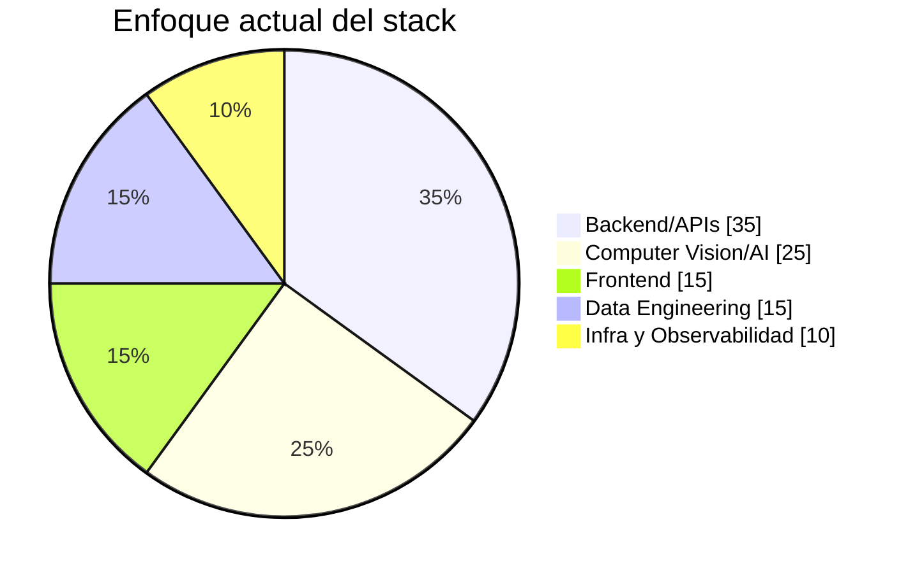

# Cristian Tascón

```
backend · full stack · systems that scale
// Bogotá, Colombia
```

I build backend systems that don't fall apart under pressure. 3+ years working on real-time infrastructure, computer vision pipelines, and distributed architectures — mostly in Python, mostly with measurable outcomes. I care about clean code, observable systems, and not reinventing the wheel unless it's worth it.

---

## Stack

### backend / api


### frontend


### data


### infra / devops


### observabilidad y testing


### ai / computer vision


---

## Impact

| metric | result | context |
|--------|--------|---------|
| **96%** cost reduction | ML model | Starlink overuse prediction |
| **50%** less memory | event-driven refactor | async + decoupled services |
| **85%+** precision | real-time YOLO | industrial PPE detection |
| **30%** fewer prod errors | pytest suite | unit + integration coverage |
| **40%** less failure detection time | Grafana + Prometheus | Docker monitoring |
| **35%** faster queries | PostgreSQL optimization | 30k+ records |

---


## Stack focus




---

## Projects

**[Operations Management Platform](https://github.com/cristianT2002)**  
Full-stack platform for field operations. REST API (Flask + SQLAlchemy), multi-schema PostgreSQL, React frontend with Redux Toolkit and interactive maps (Leaflet). 2FA, HTTP compression, HTTPS reverse proxy. Clean dev/prod environment separation.  
`React` `Flask` `PostgreSQL` `Docker` `Redux` `Leaflet`

**[Industrial Risk Detection System](https://github.com/cristianT2002)**  
Real-time backend for PPE compliance and unauthorized access detection via YOLO + OpenCV. RTSP stream processing with GPU inference. Event-driven alert pipeline (SMTP + WhatsApp API). 15–20 high-value alerts/day with 85%+ precision.  
`FastAPI` `YOLO` `OpenCV` `Event Bus` `Clean Architecture` `GPU`

---

## Contact

[linkedin.com/in/cristiantasconm](https://linkedin.com/in/cristiantasconm) · cristiantmm11@outlook.com

---

*Electronic Engineer · Universidad de San Buenaventura, Bogotá · 2024*
